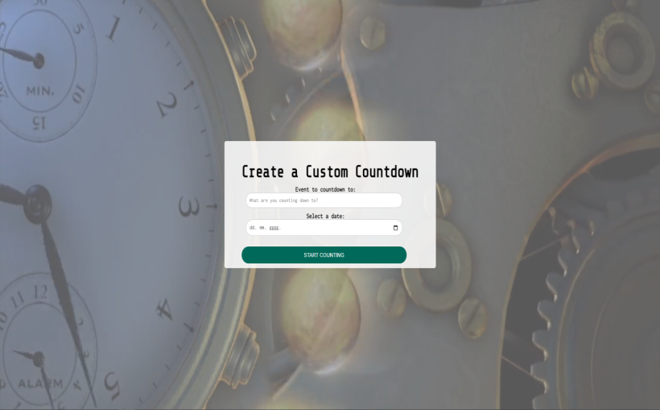
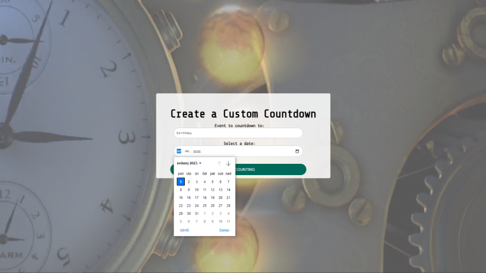
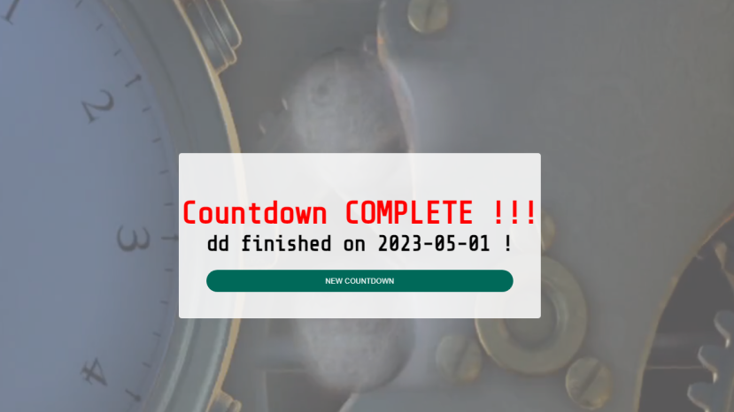

# Custom Countdown Page

## Login

To get access to the app's content you need to run it into your browser.

## Content

After loading page, user is by default switched on home page.

 User then should click on form to choose an event to countdown to and a date.  
 
 

 After clicking on submit button, countdown starts.  
 

 Items from countdown are saved in Local Storage so when refreshing a page, countdown event will not be lost.  
 One can only undo countdown with reset button.  
 Countdown will run until it's finished. 
 

## Used content links
* Fonts: https://fonts.google.com/
* Icons: https://fontawesome.com/icons?d=gallery&q=close&m=free
* Video: https://pixabay.com/videos/

# 👉 Built with
* HTML5
* CSS3
* JS

# 💻 Development
1. run index.html on your browser
2. git clone https://github.com/valerijadrinek/custom-countdown.git
3. github pages https://valerijadrinek.github.io/custom-countdown/
